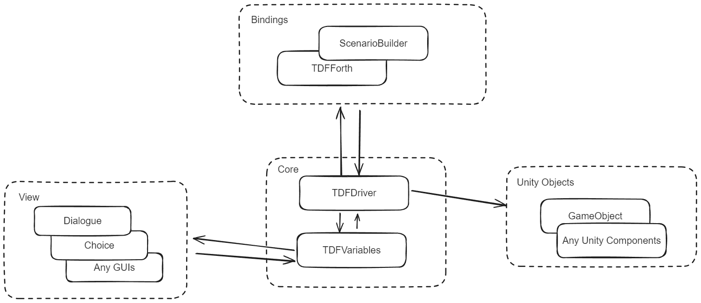

# ブロック構成

TDF の大まかなブロック構成を以下に示します

TDF は、大きく Core/Bindings/View と呼ばれるブロックで構成されており、これらが連携しつつシナリオを進行させていきます。

## Core

TDF の制御システムの根幹を構成するブロックで、各種変数の管理や、多重処理の制御を行っています
いわゆる MVCP モデルの P と M の部分を担当しますが、後述のように厳密に M と P が分離しているわけではないのが特徴になります

### Driver

Binder からの命令を受け取り、変数機構である TDFVariables との間で Get/Set を行うほか、View に属さない Unity の GameObject（とコンポーネント群）とのやりとりを行います

### Variables

内部に変数を蓄え、Driver からの操作で中のデータを更新/発行します

一般的な Model と異なるのは、Variables 自身がイベント発火機能を持ち、後述の View は Variables に対して Listen を行うことで Driver ではなく Variables からイベントを受け取るという点です

これにより、Driver は View の操作については関知せず、ただ変数操作を行うだけになっています

View を自由に差し替えられる TDF の基本構造はこの設計に基づいています

## Binding

基本的に C#の API しか持たない Driver に対し、各種言語やビジュアル環境で命令を発行します

Binding は Driver としか関係を持っておらず、他のブロックからは完全に分離されています

これにより、Binding は Driver とさえ連結していればよく、比較的簡単に新しい Binding を実装することが可能になっています

### TDFForth

TDF の最も基本的な Binding であり、Forth 言語のサブセットに若干の拡張を加えた TDFForth という言語で Driver を操作します

TDF スクリプトは、TDFForth のトークナイズ（一般的な言語で言うパージング/Forth はパーサーを持たないので）時点の処理モードを切り替えただけであり、内部的には同じ Forth インタプリタで動いています

### ScenarioBuilder

スクリプトではなく Unity 内のビジュアル環境でコードレスで制御したいユースケース向けに用意されたビジュアル環境です

## View

会話ボックス、選択肢など会話シーンに必要な画面パーツ群が View です。自身が独立したステートマシンであり、TDFDriver の管理下になく、DFVariables 内の変数からのイベントを受け取り、自身を更新します。
これにより TDFDriver から独立しており、動的に付け外しの出来るモジュール構造を実現しています

### Dialogue

いわゆる「会話ボックス」です。TDFVriables の中の Dialogue 用システム変数からのイベントを Listen し、会話を表示し、プレイヤーの入力等による状態遷移が発生した時はシステム変数を更新します。詳細は[Dialogue](Dialogue.md)を参照してください

### Choice

プレイヤーによる何らかの選択を受け取る「選択メニュー」を表示します。詳細は[Choice](Choice.md)を参照してください

### Logger

会話のバックログを表示する View です。詳細は[Logger]()を参照してください

### Guage

TDFValue 内の数値(float もしくは int)を監視してグラフィカルに表示する View です。いわゆる HP ゲージのような機能を実現するためのものです。詳細は[その他 GUI]()を参照してください

### Watcher

Guage とほぼ同じ機能を持ちますが、こちらは直接変数の内容を表示します。詳細は[その他 GUI]()を参照してください
